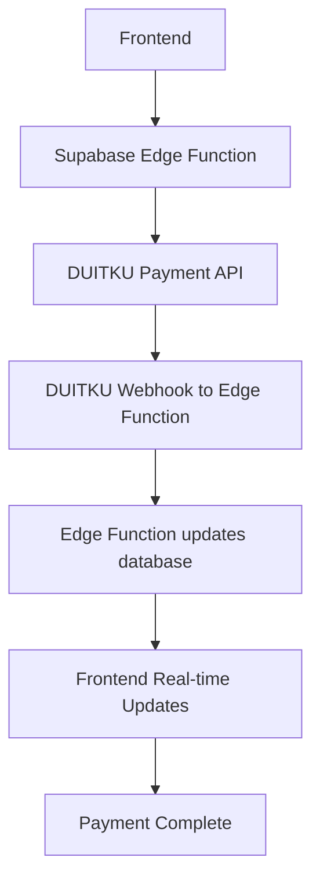

- Arsitektur Electron + Supabase (V2) - Updated with Supabase Edge Functions
- Strategi frontend berbasis **Vite + shadcn/ui + Animate UI**  
- Prinsip phased development  
- Rekomendasi UI/UX yang realistis dan performan  

# **Architecture Summary: Local-First WhatsApp Automation App - Xender-In**
**Version**: 2.2 — Supabase Edge Functions Integration
**Last Updated**: November 15, 2025
**Status**: MVP-Ready, Phased Execution Locked

---

## 1. Project Overview

**Xender-In** is a **local-first automation app** using **Electron** and **Supabase**, where WhatsApp automation runs **fully on the user's device** via `whatsapp-web.js` and Puppeteer.
Supabase handles **authentication**, **metadata**, **quota control**, **activity logging**, and **payment processing** via Edge Functions — **not runtime execution**.

> 🔑 **Core Principle**:  
> **Runtime and assets execute locally**; Supabase acts as **meta disk**, **quota enforcer**, **payment processor**, and **optional sync source**.

---

## 2. Full Technical Stack

### Desktop App (Electron Client)
- **Electron** – Main process (Node.js runtime)  
- **React (Vite + TypeScript)** – Renderer UI  
- **Preload.js** – Secure IPC bridge (limited API surface)  
- **Dexie** – Local IndexedDB (contacts, templates, WAL, assets)  
- **Keytar** – Secure JWT & local secrets storage  
- **whatsapp-web.js + Puppeteer** – Local WhatsApp session runtime  
- **Sharp** – Image compression before upload  

### Frontend (Renderer Layer)
- **Vite** – Build tool (HMR, fast dev server)  
- **Tailwind CSS** – Atomic styling  
- **shadcn/ui** – Base UI primitives (**open code**, no NPM wrapper)  
- **Animate UI** – Motion-enhanced components (**via `npx shadcn add`**)  
- **Lucide React** – Icons (tree-shakable, consistent with shadcn)  
- **Path alias**: `@/` → resolves to `/src` (IDE & build compatible)  

> ❌ **Tidak menggunakan**:  
> - `ui.aevr.space` (tidak valid / tidak terverifikasi)  
> - Magic UI (terlalu heavy untuk productivity tool)  
> - Library UI berbasis NPM (menghindari wrapper & bundle bengkak)

### Backend (Supabase)
- **Supabase Auth** (Email/Password)  
- **Postgres** – Tables: `subscriptions`, `team_members`, `reservations`, `activity_logs`  
- **Storage** – Asset backup  
- **RPC** – `reserve_quota`, `commit_reservation`  
- **Edge Functions** – Payment processing and webhook handling  
- **RLS** – Tenant isolation per `master_user_id`  

---

## 3. Frontend Strategy & Rationale

### ✅ Kenapa shadcn/ui + Animate UI?
- **Open code model**: semua komponen disalin ke `/src/components/ui/` → bisa di-edit sesuka lo  
- **Zero runtime overhead**: tidak ada wrapper, class conflict, atau styling leak  
- **Animate UI = shadcn + Framer Motion**: animasi micro-interaction (hover, load, exit) yang **ringan & accessible**  
- **Sangat cocok untuk Electron**: bundle minimal, tidak andalkan SSR/CDN

### 🛠 Setup Standard (Dari `Frontend Design_1_ReadME.md`)
```bash
npm create vite@latest my-app -- --template react-ts
cd my-app
npm install tailwindcss @tailwindcss/vite lucide-react
npx tailwindcss init -p
# → konfigurasi tsconfig.json + vite.config.ts untuk path alias "@/"
npx shadcn-ui@latest init  # pilih Neutral base color

# Tambah komponen
npx shadcn-ui@latest add button card input alert
npx shadcn-ui@latest add animated-button animated-card  # dari Animate UI registry
```

> 📌 Semua komponen masuk ke `src/components/ui/` → bisa dihapus di Phase akhir jika tidak dipakai.

### 🎨 UI Scope per Phase
| Phase | Komponen yang Dipakai | Animasi? |
|------|------------------------|--------|
| **Phase 1 (Mock UI)** | Button, Card, Input, Dialog, Tabs | ✅ `AnimatedButton` untuk action utama (Send, Reserve) |
| **Phase 2 (Real Data)** | Table, Skeleton, Progress, Alert | ✅ `FadeIn` saat load data |
| **Phase 3 (Polish)** | PIN Keypad, WAL Status, Sync Progress | ⚠️ Animasi **minimal** — fokus ke kejelasan |

> 💡 **Guideline**: Animasi hanya untuk **feedback & state change**, bukan dekorasi.

---

## 4. Core Execution Flow

### 🔹 Authentication
1. Login via Supabase Auth → Store JWT in **Keytar**  
2. Fetch metadata (`quota`, `plan`) → **50% sync rule**  
3. Show **Local PIN modal** (Owner/Staff)

### 🔹 Dual Sync System
| Type | Data | Trigger | Consent |
|------|------|--------|--------|
| **Auto Sync** | Account meta (quota, team) | Login | ❌ |
| **Manual Sync** | Contacts, templates, assets | Post-PIN | ✅ |

> ✅ User bisa skip manual sync → pakai data lokal

### 🔹 Payment Flow (Enhanced with Supabase Edge Functions)


### 🔹 Sending Flow (Phase 3)
1. Configure: group, template, delay  
2. **Reserve quota** → Supabase RPC  
3. Persist to **Dexie WAL**  
4. Execute via **WhatsApp State Machine**  
5. **Commit** → update quota + logs

---

## 5. Data Isolation & Cleanup

### 🔒 Per-User Isolation
All local data scoped by `master_user_id`:
```
%AppData%/Xender-In/{master_user_id}/
  ├── session/
  ├── dexie-db/
  └── assets/
```

### 🧹 Uninstall Cleanup
- Windows: `electron-builder` NSIS script hapus seluruh folder Xender-In
- Pastikan **tidak ada sisa session atau kontak**

---

## 6. Development Phases (Frontend-Aligned)

### Phase 1 — UI-First MVP (Mock Data)
- ✅ Full flow: login → PIN → contact list → send config → history  
- ✅ Pakai **shadcn/ui + Animate UI** untuk semua komponen  
- ❌ No Supabase, ❌ No Puppeteer  
- ✅ Abstraction layer: `ContactService`, `QuotaService` (mock → real swap)

### Phase 2 — Supabase Integration + Payment
- ✅ Replace mock dengan **real Supabase client**  
- ✅ Sync logic + WAL setup  
- ✅ **Supabase Edge Functions** for payment processing  
- ✅ **Simulate Send** → trigger commit tanpa WhatsApp

### Phase 3 — WhatsApp Runtime + Polish
- ✅ Integrate Puppeteer + **State Machine**  
- ✅ Final UI: error states, progress feedback, offline handling  
- ✅ **Cleanup**: hapus semua komponen UI yang tidak dipakai

---

## 7. Post-MVP Policy

- Setelah Phase 3 stabil: **HENTIKAN pengembangan Electron**  
- Buat `FUTURE_ARCHITECTURE.md` untuk **Admin Web UI** (separate project)  
- Semua perubahan Supabase wajib lewat **MCP workflow** (no Studio edits)

---

## 8. Key Principles Recap

1. ✅ **Local-first execution** = no backend dependency for runtime  
2. ✅ **Supabase = meta disk + payment processor**, bukan controller  
3. ✅ **Phased delivery**: UI → Backend → WhatsApp  
4. ✅ **shadcn/ui + Animate UI** = satu-satunya sumber komponen  
5. ✅ **Zero unverified UI libraries** (no AEVR, no Magic UI)  
6. ✅ **Per-user data isolation**  
7. ✅ **Uninstall cleanup enforced**  
8. ✅ **RPC = single source of truth untuk quota**  
9. ✅ **Edge Functions = secure payment processing**  
10. ✅ **Phase 3 = hard stop** → arsitektur baru untuk produk berikutnya

---

📄 **Next**: Generate `FUTURE_ARCHITECTURE.md` setelah MVP selesai