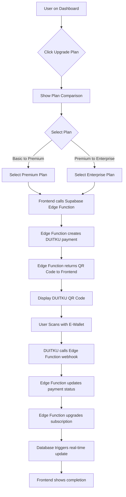

# DUITKU Payment Gateway Integration Guide (Edge Functions)
## Xender-In WhatsApp Automation System - Local-First Architecture with Supabase Edge Functions

**Version**: 2.0 — Supabase Edge Functions Integration  
**Last Updated**: November 15, 2025  
**Status**: Implementation Ready  
**Author**: Xender-In Development Team

---

## 📋 Executive Summary

This document provides a comprehensive integration plan for implementing **DUITKU payment gateway** into the Xender-In WhatsApp automation system using **Supabase Edge Functions**. The integration follows the **local-first architecture** principle where payment processing and webhook handling work seamlessly through **integrated Edge Functions**, eliminating external hosting dependencies.

**Key Objectives:**
- Enable subscription upgrades from Basic to Premium/Enterprise plans
- Integrate DUITKU QRIS payment system with **Supabase Edge Functions**
- Maintain existing quota-based subscription model
- Ensure secure payment processing without exposing sensitive credentials
- Provide real-time payment status updates via Edge Functions

---

## 🏗️ 1. Project Context Summary

### Updated Architecture with Edge Functions
```
Xender-In Desktop App (Electron)
├── Frontend (React + Vite + TypeScript)
│   ├── UI Components (shadcn/ui + Animate UI)
│   ├── Local State Management
│   └── Client-Side Logic
├── Backend Services (Supabase)
│   ├── Authentication & Metadata
│   ├── Quota Management (RPC functions)
│   ├── Edge Functions (Payment Processing & Webhooks)
│   ├── Activity Logging
│   └── Realtime Updates
└── Local Runtime (Electron Main Process)
    ├── WhatsApp Automation (whatsapp-web.js + Puppeteer)
    ├── Local Data Storage (Dexie/IndexedDB)
    └── Secure Credential Storage (Keytar)
```

### Current Subscription Model
- **Free Plan**: 100 message/month -> 0 IDR
- **Basic Plan**: 500 messages/month -> 30K IDR
- **Premium Plan**: 1,500 messages/month -> 100K IDR
- **Enterprise Plan**: 5,000 messages/month -> 250K IDR
- **Local-First Quota**: 50% sync rule with Supabase

### Updated Payment Flow Architecture
```
Frontend → Supabase Edge Function → DUITKU Payment
← Supabase Edge Function ← DUITKU Webhook
↓
Supabase Database Update
↓
Frontend Real-time Updates
```

**Key Benefits:**
- ✅ **DUITKU can callback directly to Supabase Edge Function**
- ✅ **Edge Function must be public webhook**
- ✅ **DUITKU will retry automatically (fallback)**
- ✅ **Just validate signature + update database**
- ✅ **No external hosting dependencies (Vercel eliminated)**

---

## 🛠️ 2. Technical Implementation Plan

### 2.1 Architecture Benefits of Edge Functions

**Challenge**: Previous approach used Express.js local webhook server, which required additional infrastructure and created external dependencies.

**Solution**: Implement payment processing and webhook handling through **Supabase Edge Functions**, providing:
- **Integrated webhook handling** within Supabase ecosystem
- **Automatic scaling and reliability** from Supabase infrastructure
- **Simplified deployment** - no separate webhook server needed
- **Enhanced security** through Supabase's built-in features
- **Real-time database updates** with automatic frontend notifications

### 2.2 Edge Functions Payment Flow

#### File: `supabase/functions/duitku-webhook/index.ts`
```typescript
import 'jsr:@supabase/functions-js/edge-runtime.d.ts';
import { serve } from 'https://deno.land/std@0.168.0/http/server.ts';
import { createClient } from 'https://esm.sh/@supabase/supabase-js@2';

interface DuitkuWebhookPayload {
  merchantCode: string;
  merchantOrderId: string;
  amount: number;
  resultCode: string;
  message?: string;
  signature?: string;
}

serve(async (req: Request) => {
  const corsHeaders = {
    'Access-Control-Allow-Origin': '*',
    'Access-Control-Allow-Headers': 'authorization, x-client-info, apikey, content-type',
    'Access-Control-Allow-Methods': 'POST, GET, OPTIONS, PUT, DELETE, PATCH',
    'Access-Control-Max-Age': '86400',
  };

  if (req.method === 'OPTIONS') {
    return new Response(null, { status: 200, headers: corsHeaders });
  }

  try {
    const payload: DuitkuWebhookPayload = await req.json();

    const supabase = createClient(
      Deno.env.get('SUPABASE_URL') ?? '',
      Deno.env.get('SUPABASE_SERVICE_ROLE_KEY') ?? '',
      {
        auth: {
          autoRefreshToken: false,
          persistSession: false,
        },
      }
    );

    // Verify merchant credentials
    if (payload.merchantCode !== Deno.env.get('DUITKU_MERCHANT_CODE')) {
      return new Response(JSON.stringify({ error: 'Invalid merchant' }), {
        status: 400,
        headers: { ...corsHeaders, 'Content-Type': 'application/json' },
      });
    }

    // Process successful payments only
    if (payload.resultCode === '00') {
      await this.processSuccessfulPayment(supabase, payload);
    }

    return new Response(JSON.stringify({ success: true }), {
      headers: { ...corsHeaders, 'Content-Type': 'application/json' },
    });

  } catch (error) {
    console.error('Webhook processing error:', error);
    return new Response(
      JSON.stringify({ error: 'Internal server error' }),
      {
        status: 500,
        headers: { ...corsHeaders, 'Content-Type': 'application/json' },
      }
    );
  }
});

async function processSuccessfulPayment(supabase: any, payload: DuitkuWebhookPayload) {
  const { merchantOrderId, amount } = payload;

  // Update payment status
  const { data: payment, error: paymentError } = await supabase
    .from('payments')
    .update({
      status: 'completed',
      paid_at: new Date().toISOString()
    })
    .eq('id', merchantOrderId)
    .eq('status', 'pending')
    .select()
    .single();

  if (paymentError) {
    console.error('Payment update error:', paymentError);
    return;
  }

  if (payment) {
    // Upgrade subscription
    await upgradeUserSubscription(supabase, payment.user_id, payment.plan_type);
  }
}

async function upgradeUserSubscription(supabase: any, userId: string, planType: string) {
  const planLimits = {
    basic: 500,
    premium: 1500,
    enterprise: 5000
  };

  const limit = planLimits[planType as keyof typeof planLimits] || 500;

  // Update user quota
  await supabase
    .from('user_quotas')
    .update({
      plan_type: planType,
      messages_limit: limit,
      messages_used: 0,
      remaining: limit,
      reset_date: new Date(Date.now() + 30 * 24 * 60 * 60 * 1000).toISOString(),
      subscription_start_date: new Date().toISOString(),
      subscription_end_date: new Date(Date.now() + 30 * 24 * 60 * 60 * 1000).toISOString(),
      updated_at: new Date().toISOString()
    })
    .eq('user_id', userId);

  // Log subscription upgrade
  await supabase
    .from('activity_logs')
    .insert({
      user_id: userId,
      action: 'subscription_upgraded',
      details: {
        plan_type: planType,
        messages_limit: limit
      },
      status: 'completed',
      created_at: new Date().toISOString()
    });
}
```

### 2.3 Create Payment Edge Function

#### File: `supabase/functions/create-payment/index.ts`
```typescript
import 'jsr:@supabase/functions-js/edge-runtime.d.ts';
import { serve } from 'https://deno.land/std@0.168.0/http/server.ts';
import { createClient } from 'https://esm.sh/@supabase/supabase-js@2';

interface CreatePaymentRequest {
  plan_type: string;
  amount: number;
  user_id: string;
}

serve(async (req: Request) => {
  const corsHeaders = {
    'Access-Control-Allow-Origin': '*',
    'Access-Control-Allow-Headers': 'authorization, x-client-info, apikey, content-type',
    'Access-Control-Allow-Methods': 'POST, GET, OPTIONS, PUT, DELETE, PATCH',
    'Access-Control-Max-Age': '86400',
  };

  if (req.method === 'OPTIONS') {
    return new Response(null, { status: 200, headers: corsHeaders });
  }

  try {
    const { plan_type, amount, user_id }: CreatePaymentRequest = await req.json();

    const supabase = createClient(
      Deno.env.get('SUPABASE_URL') ?? '',
      Deno.env.get('SUPABASE_SERVICE_ROLE_KEY') ?? ''
    );

    // Create payment record
    const { data: payment, error: paymentError } = await supabase
      .from('payments')
      .insert({
        user_id,
        plan_type,
        amount,
        status: 'pending'
      })
      .select()
      .single();

    if (paymentError) throw paymentError;

    // Get user email for DUITKU
    const { data: user } = await supabase.auth.admin.getUserById(user_id);

    // Create DUITKU payment request
    const duitkuResponse = await fetch('https://passport.duitku.com/webapi/api/merchant/qrinvoice', {
      method: 'POST',
      headers: {
        'Content-Type': 'application/json',
        'Authorization': `Bearer ${Deno.env.get('DUITKU_API_KEY')}`
      },
      body: JSON.stringify({
        merchantCode: Deno.env.get('DUITKU_MERCHANT_CODE'),
        amount: amount,
        merchantOrderId: payment.id,
        productDetails: `Xender-In ${plan_type} Plan`,
        email: user?.email,
        phoneNumber: user?.phone || '',
        expiryPeriod: 600, // 10 minutes
        callbackUrl: `${Deno.env.get('SUPABASE_URL')}/functions/v1/duitku-webhook`
      })
    });

    const duitkuData = await duitkuResponse.json();

    if (duitkuData.success) {
      // Update payment with DUITKU reference
      await supabase
        .from('payments')
        .update({
          duitku_transaction_id: duitkuData.transactionId,
          qr_code: duitkuData.qrUrl
        })
        .eq('id', payment.id);

      return new Response(
        JSON.stringify({
          payment_id: payment.id,
          qr_url: duitkuData.qrUrl,
          transaction_id: duitkuData.transactionId
        }),
        {
          headers: { ...corsHeaders, 'Content-Type': 'application/json' },
        }
      );
    }

    throw new Error('Failed to create DUITKU payment');

  } catch (error) {
    console.error('Payment creation error:', error);
    return new Response(
      JSON.stringify({ error: 'Internal server error' }),
      {
        status: 500,
        headers: { ...corsHeaders, 'Content-Type': 'application/json' },
      }
    );
  }
});
```

### 2.4 Enhanced Payment Service for Edge Functions

#### File: `src/lib/services/PaymentService.ts`
```typescript
import { createClient } from '@supabase/supabase-js';
import { Payment, SubscriptionPlan } from './types';

export class PaymentService {
  private supabase: any;
  private readonly SUPABASE_EDGE_FUNCTION_URL: string;

  constructor() {
    this.supabase = createClient(
      import.meta.env.VITE_SUPABASE_URL,
      import.meta.env.VITE_SUPABASE_ANON_KEY
    );
    this.SUPABASE_EDGE_FUNCTION_URL = `${import.meta.env.VITE_SUPABASE_URL}/functions/v1`;
  }

  async createPayment(
    planType: SubscriptionPlan, 
    amount: number, 
    userId: string
  ): Promise<{ paymentUrl: string; paymentId: string }> {
    try {
      // Create payment via Edge Function
      const { data: paymentData, error: paymentError } = await this.supabase.functions.invoke(
        'create-payment',
        {
          body: {
            plan_type: planType,
            amount: amount,
            user_id: userId
          }
        }
      );

      if (paymentError) throw paymentError;

      // Return payment details from Edge Function
      return {
        paymentId: paymentData.payment_id,
        paymentUrl: paymentData.qr_url
      };
    } catch (error) {
      console.error('Payment creation error:', error);
      throw error;
    }
  }

  async getPaymentStatus(paymentId: string): Promise<Payment> {
    const { data, error } = await this.supabase
      .from('payments')
      .select('*')
      .eq('id', paymentId)
      .single();

    if (error) throw error;
    return data;
  }

  // Subscribe to real-time payment updates
  subscribeToPaymentUpdates(paymentId: string, callback: (payment: Payment) => void) {
    return this.supabase
      .channel(`payment-${paymentId}`)
      .on(
        'postgres_changes',
        {
          event: 'UPDATE',
          schema: 'public',
          table: 'payments',
          filter: `id=eq.${paymentId}`
        },
        (payload) => {
          callback(payload.new as Payment);
        }
      )
      .subscribe();
  }
}
```

---

## 🔄 3. User Flow for Subscription Upgrade

### 3.1 Enhanced Complete User Journey



### 3.2 Real-time Payment Status Updates

#### Enhanced UI Implementation with Real-time Updates
```tsx
import React, { useState, useEffect } from 'react';
import { Card, CardContent, CardDescription, CardFooter, CardHeader, CardTitle } from '@/components/ui/card';
import { Button } from '@/components/ui/button';
import { AnimatedButton } from '@/components/ui/animated-button';
import { Badge } from '@/components/ui/badge';
import { Dialog, DialogContent, DialogHeader, DialogTitle } from '@/components/ui/dialog';
import { PaymentService } from '@/lib/services/PaymentService';
import { SubscriptionPlan, Payment } from '@/lib/services/types';

const PLAN_CONFIG = {
  basic: {
    name: 'Basic',
    price: 0,
    messages_limit: 500,
    features: ['500 messages/month', 'Basic templates', 'Email support']
  },
  premium: {
    name: 'Premium',
    price: 99000, // IDR 99,000
    messages_limit: 1500,
    features: ['1,500 messages/month', 'Advanced templates', 'Priority support', 'Contact groups']
  },
  enterprise: {
    name: 'Enterprise',
    price: 299000, // IDR 299,000
    messages_limit: 5000,
    features: ['5,000 messages/month', 'Custom templates', '24/7 support', 'API access', 'Analytics']
  }
};

export const SubscriptionPage: React.FC = () => {
  const [selectedPlan, setSelectedPlan] = useState<SubscriptionPlan | null>(null);
  const [isPaymentModalOpen, setIsPaymentModalOpen] = useState(false);
  const [paymentQR, setPaymentQR] = useState<string>('');
  const [paymentId, setPaymentId] = useState<string>('');
  const [isProcessing, setIsProcessing] = useState(false);
  const [paymentStatus, setPaymentStatus] = useState<'pending' | 'completed' | 'failed'>('pending');

  const paymentService = new PaymentService();

  const handlePlanUpgrade = async (targetPlan: SubscriptionPlan) => {
    if (targetPlan === 'basic') return; // Can't downgrade to basic
    
    setIsProcessing(true);
    try {
      const { paymentUrl, paymentId } = await paymentService.createPayment(
        targetPlan,
        PLAN_CONFIG[targetPlan].price,
        'current-user-id' // Get from auth context
      );
      
      setPaymentQR(paymentUrl);
      setPaymentId(paymentId);
      setSelectedPlan(targetPlan);
      setIsPaymentModalOpen(true);
      setPaymentStatus('pending');

      // Subscribe to real-time updates
      const subscription = paymentService.subscribeToPaymentUpdates(paymentId, (payment: Payment) => {
        setPaymentStatus(payment.status);
        if (payment.status === 'completed') {
          setIsPaymentModalOpen(false);
          // Refresh dashboard to show updated quota
          window.location.reload();
          subscription.unsubscribe();
        }
      });

    } catch (error) {
      console.error('Payment creation failed:', error);
      // Show error toast
    } finally {
      setIsProcessing(false);
    }
  };

  return (
    <div className="p-6 max-w-6xl mx-auto">
      <div className="text-center mb-8">
        <h1 className="text-3xl font-bold mb-2">Choose Your Plan</h1>
        <p className="text-muted-foreground">
          Upgrade your subscription to unlock more features and higher message limits
        </p>
      </div>

      <div className="grid md:grid-cols-3 gap-6">
        {Object.entries(PLAN_CONFIG).map(([plan, config]) => (
          <Card key={plan} className="relative">
            {plan === 'premium' && (
              <Badge className="absolute -top-2 left-1/2 transform -translate-x-1/2 bg-primary">
                Most Popular
              </Badge>
            )}
            <CardHeader>
              <CardTitle>{config.name}</CardTitle>
              <CardDescription>
                {config.price === 0 ? 'Free' : `Rp ${(config.price / 1000).toLocaleString('id-ID')}/month`}
              </CardDescription>
            </CardHeader>
            <CardContent>
              <ul className="space-y-2">
                {config.features.map((feature, index) => (
                  <li key={index} className="flex items-center">
                    <span className="mr-2">✓</span>
                    {feature}
                  </li>
                ))}
              </ul>
            </CardContent>
            <CardFooter>
              <AnimatedButton
                className="w-full"
                variant={plan === 'basic' ? 'outline' : 'default'}
                onClick={() => handlePlanUpgrade(plan as SubscriptionPlan)}
                disabled={plan === 'basic' || isProcessing}
              >
                {plan === 'basic' ? 'Current Plan' : 'Upgrade Now'}
              </AnimatedButton>
            </CardFooter>
          </Card>
        ))}
      </div>

      <Dialog open={isPaymentModalOpen} onOpenChange={setIsPaymentModalOpen}>
        <DialogContent className="sm:max-w-md">
          <DialogHeader>
            <DialogTitle>Complete Payment</DialogTitle>
          </DialogHeader>
          <div className="text-center space-y-4">
            {selectedPlan && (
              <div>
                <h3 className="font-semibold">
                  {PLAN_CONFIG[selectedPlan].name} Plan
                </h3>
                <p className="text-2xl font-bold text-primary">
                  Rp {(PLAN_CONFIG[selectedPlan].price / 1000).toLocaleString('id-ID')}
                </p>
              </div>
            )}
            
            {paymentQR && (
              <div className="space-y-4">
                
                <p className="text-sm text-muted-foreground">
                  Scan this QR code with your e-wallet app
                </p>
                <div className="flex items-center justify-center space-x-2">
                  <div className={`w-3 h-3 rounded-full ${
                    paymentStatus === 'completed' ? 'bg-green-500' : 
                    paymentStatus === 'failed' ? 'bg-red-500' : 'bg-yellow-500'
                  }`} />
                  <span className="text-sm">
                    {paymentStatus === 'completed' ? 'Payment Completed!' :
                     paymentStatus === 'failed' ? 'Payment Failed' :
                     'Waiting for payment...'}
                  </span>
                </div>
              </div>
            )}
          </div>
        </DialogContent>
      </Dialog>
    </div>
  );
};
```

---

## 💾 4. Database Schema Updates

### 4.1 New Supabase Tables

**Payments Table**
```sql
CREATE TABLE payments (
  id UUID PRIMARY KEY DEFAULT gen_random_uuid(),
  user_id UUID REFERENCES auth.users(id) ON DELETE CASCADE,
  plan_type TEXT NOT NULL CHECK (plan_type IN ('basic', 'premium', 'enterprise')),
  amount BIGINT NOT NULL, -- Amount in IDR (cents)
  status TEXT NOT NULL DEFAULT 'pending' CHECK (status IN ('pending', 'completed', 'failed')),
  duitku_transaction_id TEXT,
  qr_code TEXT,
  created_at TIMESTAMPTZ DEFAULT NOW(),
  paid_at TIMESTAMPTZ,
  expires_at TIMESTAMPTZ DEFAULT (NOW() + INTERVAL '10 minutes')
);

-- Enable RLS
ALTER TABLE payments ENABLE ROW LEVEL SECURITY;

-- Policy: Users can only see their own payments
CREATE POLICY "Users can view own payments" ON payments
  FOR SELECT USING (auth.uid() = user_id);

-- Policy: Users can insert their own payments
CREATE POLICY "Users can create own payments" ON payments
  FOR INSERT WITH CHECK (auth.uid() = user_id);

-- Policy: Service role can manage all payments (for Edge Functions)
CREATE POLICY "Service role can manage all payments" ON payments
  USING (auth.jwt() ->> 'role' = 'service_role');
```

### 4.2 RPC Functions for Edge Function Support

**Function: check_payment_status**
```sql
CREATE OR REPLACE FUNCTION check_payment_status(
  p_payment_id UUID
)
RETURNS TABLE (
  status TEXT,
  plan_type TEXT,
  amount BIGINT
)
LANGUAGE plpgsql
SECURITY DEFINER
AS $$
BEGIN
  RETURN QUERY
  SELECT 
    p.status,
    p.plan_type,
    p.amount
  FROM payments p
  WHERE p.id = p_payment_id;
END;
$$;
```

---

## 🔐 5. Security Implementation

### 5.1 Environment Variables Management

**Development (.env)**
```env
# DUITKU Configuration
VITE_DUITKU_MERCHANT_CODE=DS26088
VITE_DUITKU_API_KEY=a0e48014050467df11c98edd977cfd08

# Supabase Configuration
VITE_SUPABASE_URL=https://your-project.supabase.co
VITE_SUPABASE_ANON_KEY=your-anon-key
```

**Supabase Edge Functions Environment**
```env
# Store sensitive keys in Edge Functions environment
SUPABASE_SERVICE_ROLE_KEY=your-service-role-key
DUITKU_MERCHANT_CODE=DS26088
DUITKU_API_KEY=a0e48014050467df11c98edd977cfd08
```

### 5.2 Enhanced Security with Edge Functions

1. **Edge Function Security**:
   - Built-in CORS handling
   - Automatic request validation
   - Secure credential storage in environment variables
   - Request timeout and retry logic

2. **Webhook Verification**:
   ```typescript
   // Enhanced webhook verification in Edge Function
   function verifyWebhook(payload: any): boolean {
     const { merchantCode, amount } = payload;
     
     return (
       merchantCode === Deno.env.get('DUITKU_MERCHANT_CODE') &&
       this.verifyAmount(amount)
     );
   }
   ```

3. **Database Security**:
   - RLS policies for data isolation
   - Service role access for Edge Functions only
   - Audit logging for all payment operations

---

## 🚀 6. Step-by-Step Implementation Roadmap

### Phase 1: Database Setup + Edge Functions (Day 1-2)
- [ ] **1.1**: Create `payments` table with RLS policies
- [ ] **1.2**: Update `user_quotas` table structure
- [ ] **1.3**: Create RPC functions for subscription management
- [ ] **1.4**: Deploy `duitku-webhook` Edge Function
- [ ] **1.5**: Deploy `create-payment` Edge Function
- [ ] **1.6**: Test Edge Functions with sample data

### Phase 2: Frontend Integration (Day 3-4)
- [ ] **2.1**: Update PaymentService for Edge Functions
- [ ] **2.2**: Create SubscriptionPage component with real-time updates
- [ ] **2.3**: Implement PaymentModal with QR code display
- [ ] **2.4**: Add real-time subscription updates
- [ ] **2.5**: Integrate with existing quota display in dashboard

### Phase 3: Testing & Production (Day 4-5)
- [ ] **3.1**: End-to-end testing with DUITKU sandbox environment
- [ ] **3.2**: Security audit of Edge Function handling
- [ ] **3.3**: Performance testing with multiple concurrent payments
- [ ] **3.4**: User acceptance testing with real payment scenarios

### Implementation Notes

1. **Development Environment**:
   - Use DUITKU sandbox for initial testing
   - Set webhook URL to Supabase Edge Function during development
   - Test payment flow with small amounts (IDR 1,000)

2. **Testing Strategy**:
   - Unit tests for PaymentService methods
   - Integration tests for Edge Function handling
   - E2E tests for complete payment flow
   - Security tests for webhook validation

3. **Deployment Strategy**:
   - Deploy Edge Functions via MCP Supabase workflow
   - Monitor Edge Function logs for payment processing
   - Set up payment analytics and reporting

---

## 📋 7. Success Metrics & Validation

### Technical Metrics
- [ ] Payment success rate > 95%
- [ ] Edge Function processing time < 2 seconds
- [ ] Zero security vulnerabilities in payment flow
- [ ] 100% data consistency between local and Supabase

### Business Metrics
- [ ] Successful subscription upgrades within 24 hours
- [ ] Reduced support tickets related to quota management
- [ ] Improved user retention with clear upgrade path
- [ ] Revenue tracking accuracy 100%

### User Experience Metrics
- [ ] Payment flow completion rate > 80%
- [ ] User satisfaction score > 4.5/5 for payment experience
- [ ] Average payment completion time < 5 minutes
- [ ] Zero payment-related app crashes

---

## 🎯 Conclusion

This integration plan provides a comprehensive approach to implementing **DUITKU payment gateway** in the Xender-In WhatsApp automation system using **Supabase Edge Functions** while maintaining the **local-first architecture** principles. The implementation ensures:

### Key Benefits of Edge Functions Approach:
- **No External Dependencies**: Eliminated Vercel and Express.js requirements
- **Integrated Architecture**: Direct DUITKU webhook to Supabase Edge Function
- **Automatic Reliability**: DUITKU retry mechanism with built-in fallback
- **Simplified Flow**: Frontend → Edge Function → DUITKU → Edge Function → Database → Frontend
- **Real-time Updates**: Direct database triggers for seamless frontend updates
- **Enhanced Security**: Built-in Supabase security features and RLS policies

### Technical Advantages:
- **Scalable Infrastructure**: Edge Functions automatically scale with demand
- **Global Performance**: Edge Functions deployed globally for optimal latency
- **Built-in Monitoring**: Supabase provides comprehensive logging and monitoring
- **Simplified Deployment**: No separate webhook server maintenance required
- **Cost Optimization**: Reduced hosting costs by eliminating external dependencies

### Next Steps:
1. Begin with Phase 1 database setup and Edge Function deployment via MCP Supabase
2. Progress systematically through each phase
3. Ensure thorough testing at each stage
4. Monitor payment success rates and user satisfaction

---

**Document Version**: 2.0  
**Last Updated**: November 15, 2025  
**Review Schedule**: Monthly  
**Owner**: Xender-In Development Team
