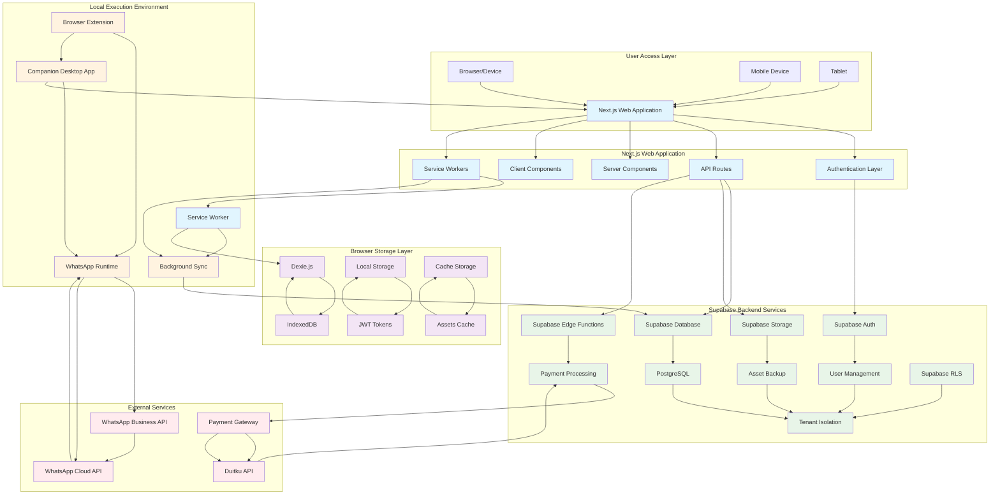
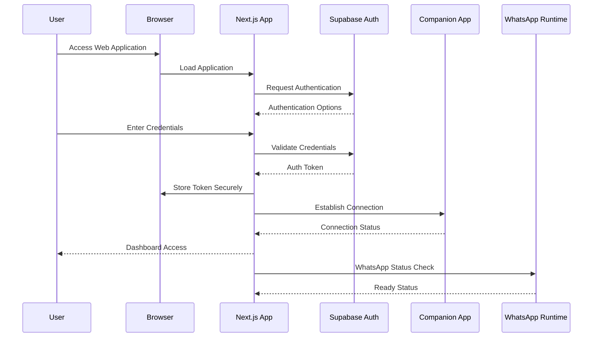
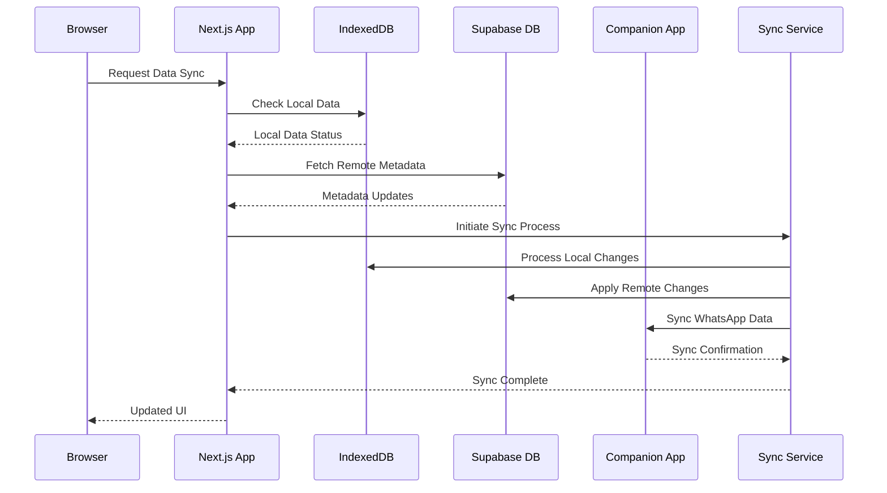
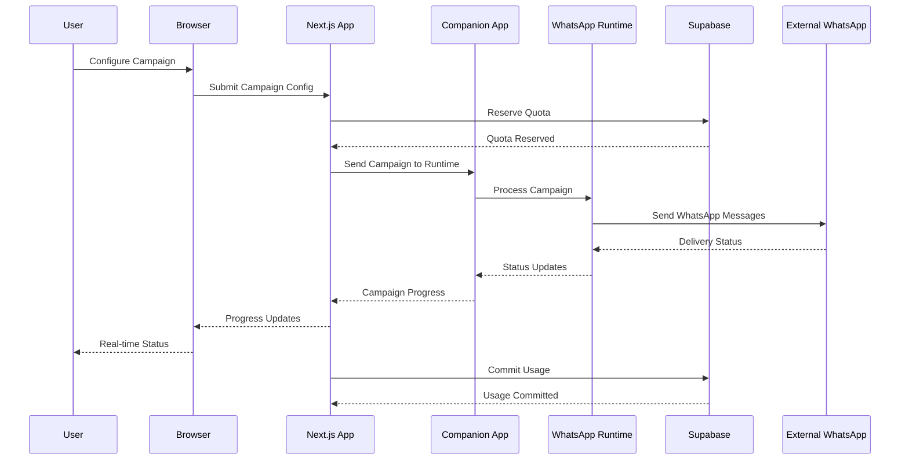

# Architecture Diagram - Xender-In Next.js Website

## System Architecture Overview

## Component Interaction Flow

### Authentication Flow

### Data Synchronization Flow

### WhatsApp Message Processing Flow

## Architecture Layers

### Presentation Layer
- **Next.js Application**: Main web interface with SSR/SSG capabilities
- **React Components**: UI elements using shadcn/ui and Tailwind CSS
- **PWA Features**: Offline capability and mobile experience

### Application Layer
- **API Routes**: Server-side functionality in Next.js
- **Server Components**: Data fetching and rendering
- **Client Components**: Interactive UI elements
- **Service Workers**: Background sync and offline support

### Data Layer
- **IndexedDB**: Local data storage via Dexie.js
- **Supabase Database**: Remote metadata and quota management
- **Supabase Storage**: Asset backup and synchronization
- **Cache Management**: Asset and data caching strategies

### Integration Layer
- **Supabase Services**: Authentication, database, storage, edge functions
- **Companion Application**: Local WhatsApp automation
- **Browser Extension**: Enhanced browser capabilities
- **External APIs**: WhatsApp Business API, payment gateways

### Security Layer
- **JWT Token Management**: Secure authentication
- **Row Level Security**: Per-user data isolation
- **End-to-End Encryption**: Data transmission security
- **Local Data Protection**: Browser storage security