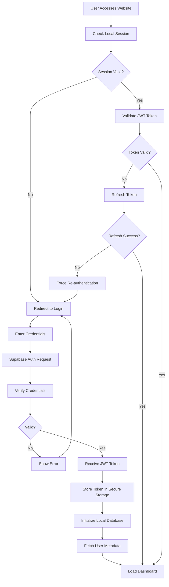
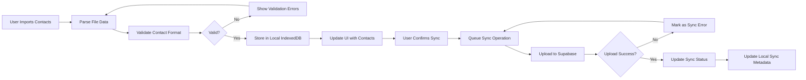
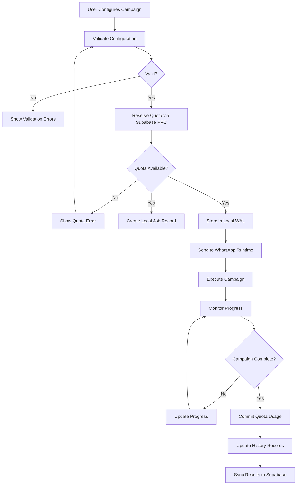

# Data Flow and Integration - Xender-In Next.js Website

## Data Flow Overview

The Xender-In Next.js website implements a sophisticated data flow architecture that maintains the local-first principles of the original Electron application while adapting to web browser constraints. The system manages data across three primary layers: browser storage (IndexedDB), Supabase backend services, and local execution environment (companion app).

## Core Data Flow Patterns

### Authentication Flow


### Contact Management Flow


### Campaign Execution Flow


## Data Synchronization Strategy

### Dual Sync System
The application implements a dual sync system that differentiates between automatic and manual synchronization:

#### Auto Sync (Unconsented)
- **Trigger**: Login/Authentication
- **Data Types**: Account metadata, quotas, team information
- **Frequency**: On every login
- **Consent**: Not required (essential for app functionality)

#### Manual Sync (Consented)
- **Trigger**: User-initiated action
- **Data Types**: Contacts, templates, assets
- **Frequency**: When explicitly requested by user
- **Consent**: Explicit user consent required

### Sync Process Implementation
```
1. Identify Changed Records
   - Check _syncStatus field in local database
   - Identify records with 'pending' status

2. Batch Processing
   - Group records by table/type
   - Apply rate limiting to prevent API overload

3. Conflict Resolution
   - Timestamp-based resolution
   - User notification for complex conflicts

4. Error Handling
   - Retry failed operations
   - Maintain sync queue for failed items

5. Status Update
   - Update _syncStatus after operation
   - Update _lastModified and _version fields
```

## Data Integration Points

### Supabase Integration
The application integrates with Supabase through multiple channels:

#### Authentication Integration
- **Supabase Auth**: Primary authentication system
- **Session Management**: JWT token handling
- **User Metadata**: Profile information and permissions

#### Database Integration
- **Direct Database Calls**: For complex queries
- **RPC Functions**: For business logic operations
- **Real-time Subscriptions**: For live updates

#### Storage Integration
- **Asset Upload**: Media files for campaigns
- **Backup Sync**: Secondary storage for important data

### Local Storage Integration
The application uses IndexedDB through Dexie.js for local data storage:

#### Schema Design
- **Sync Metadata**: Fields for tracking sync status
- **Timestamps**: Created/updated timestamps for conflict resolution
- **Versioning**: Version numbers for optimistic locking

#### Data Models
```
LocalContact {
  id: string,
  name: string,
  phone: string,
  group_id: string,
  master_user_id: string,
  _syncStatus: 'pending' | 'synced' | 'conflict' | 'error',
  _lastModified: string,
  _version: number,
  _deleted: boolean
}

LocalTemplate {
  id: string,
  name: string,
  content: string,
  master_user_id: string,
  category: string,
  _syncStatus: 'pending' | 'synced' | 'conflict' | 'error',
  _lastModified: string,
  _version: number,
  _deleted: boolean
}
```

## Data Flow Security

### Data Encryption
- **At Rest**: AES-256 encryption for sensitive local data
- **In Transit**: TLS 1.3 for all API communications
- **Token Storage**: Secure browser storage with HttpOnly cookies where possible

### Access Control
- **Row Level Security**: Supabase RLS for data isolation
- **JWT Validation**: Token validation on all protected endpoints
- **Permission Checking**: Client-side permission validation

## Data Consistency Patterns

### Optimistic Updates
- **UI Responsiveness**: Update UI immediately on user action
- **Background Sync**: Process actual operations in background
- **Error Recovery**: Rollback UI changes on operation failure

### Eventual Consistency
- **Sync Mechanism**: Background synchronization processes
- **Conflict Resolution**: Automatic resolution with user notification
- **Status Tracking**: Clear indication of sync status

## Error Handling in Data Flow

### Network Error Handling
- **Retry Logic**: Exponential backoff for failed requests
- **Offline Support**: Queue operations for later execution
- **User Feedback**: Clear error messages and recovery options

### Data Validation
- **Client-Side Validation**: Immediate feedback for user input
- **Server-Side Validation**: Backend validation for security
- **Schema Validation**: Type checking with Zod

## Performance Considerations

### Data Fetching Strategy
- **Server-Side Rendering**: Initial data fetch on server
- **Client-Side Fetching**: Additional data via API routes
- **Caching Strategy**: React Query for server state caching

### Large Dataset Handling
- **Pagination**: Server-side pagination for large datasets
- **Virtual Scrolling**: Client-side optimization for large lists
- **Batch Processing**: Chunked operations for bulk operations

## Integration with WhatsApp Runtime

### Message Data Flow
```
1. Template Configuration
   - User creates message template with variables
   - Template stored locally with sync status

2. Contact Selection
   - User selects contacts for campaign
   - Contact data validated and prepared

3. Campaign Execution
   - Campaign configuration sent to WhatsApp runtime
   - Runtime executes messages with configured delays

4. Status Updates
   - Runtime sends progress updates to web app
   - Web app updates UI and syncs to Supabase

5. Completion Processing
   - Final status synced to both local and remote storage
   - Quota usage committed to Supabase
```

### Real-time Communication
- **WebSockets**: For real-time status updates
- **Service Workers**: For background sync operations
- **Broadcast Channels**: For multi-tab synchronization

## Data Migration Strategy

### From Electron to Web
- **Data Export**: From Electron application IndexedDB
- **Data Import**: Into web application IndexedDB
- **Schema Conversion**: Adapting to web-specific schema
- **Sync Initialization**: Setting up initial sync state

## Data Backup and Recovery

### Local Data Protection
- **IndexedDB Backup**: Periodic backup of critical data
- **Export Functionality**: Manual export of important data
- **Recovery Process**: Import functionality for data recovery

### Remote Data Protection
- **Supabase Backup**: Automatic database backups
- **Version Control**: Schema changes tracked in version control
- **Disaster Recovery**: Process for data restoration