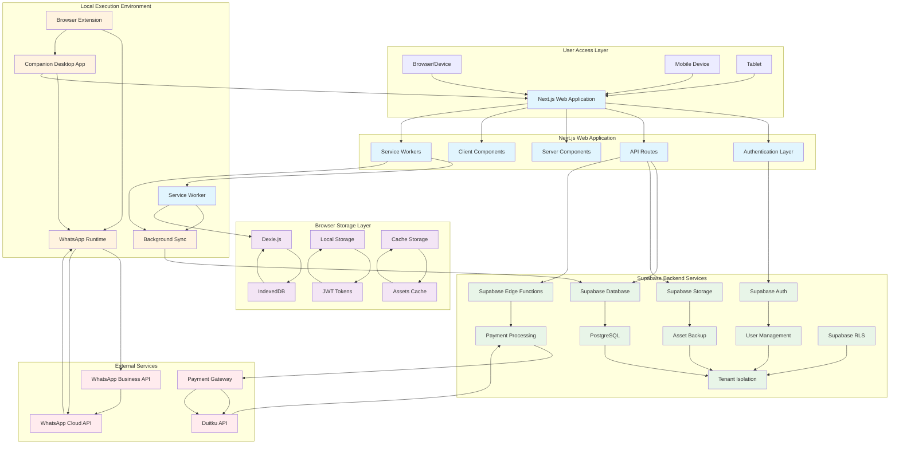

# Comprehensive Architecture Documentation - Xender-In Next.js Website

## Table of Contents
1. [System Overview](#system-overview)
2. [Architecture Diagram](#architecture-diagram)
3. [Technology Stack](#technology-stack)
4. [Component Architecture](#component-architecture)
5. [Data Flow and Integration](#data-flow-and-integration)
6. [Security Architecture](#security-architecture)
7. [Performance Optimization](#performance-optimization)
8. [Deployment Strategy](#deployment-strategy)
9. [Monitoring and Maintenance](#monitoring-and-maintenance)
10. [Future Scalability](#future-scalability)

## System Overview

The Xender-In Next.js website represents a strategic expansion of the existing Electron desktop application into the web domain. This architecture maintains the core local-first principles that define the application while adapting to the constraints and opportunities of web-based deployment.

The system is designed to provide users with the same WhatsApp automation capabilities through a browser interface while preserving the privacy, security, and performance characteristics of the original desktop application. The architecture leverages modern web technologies to deliver a seamless user experience across devices while maintaining the same underlying business logic and data management patterns.

### Core Architecture Principles

#### Local-First Design
The system adheres to the fundamental principle that runtime and assets execute locally, with Supabase serving as a meta disk, quota enforcer, and optional sync source. This approach ensures that sensitive operations remain on the user's device while leveraging cloud infrastructure for authentication, metadata management, and quota control.

#### Web-Adapted Local Execution
While the Electron app uses Puppeteer and whatsapp-web.js directly on the user's machine, the web version requires a different approach due to browser security constraints. The architecture includes a companion desktop application or browser extension to handle WhatsApp automation while the web interface provides management and configuration capabilities.

#### Data Synchronization
The system implements a dual-sync approach:
- **Auto Sync**: Automatic synchronization of account metadata, quotas, and team information upon login
- **Manual Sync**: User-initiated synchronization of contacts, templates, and assets with explicit consent

### Key Functionalities

#### Authentication and Authorization
- Secure login with email/password via Supabase Auth
- Two-factor authentication with PIN verification
- Role-based access control for team management
- Session management with secure JWT token handling

#### Core WhatsApp Automation Features
- Contact management with import/export capabilities
- Template creation with variable support
- Campaign configuration with delay settings
- Real-time progress tracking during execution
- History and analytics with detailed reporting

## Architecture Diagram



## Technology Stack

### Frontend Technologies
- **Next.js 14+**: React framework with App Router for server-side rendering, static generation, and API routes
- **React 18**: Component-based UI library with hooks and concurrent features
- **TypeScript**: Type-safe development with strict mode enabled
- **Vite**: Build tool for fast development server and optimized builds
- **Tailwind CSS**: Utility-first CSS framework for rapid UI development
- **shadcn/ui**: Accessible UI components with headless implementation
- **Framer Motion**: Animation library for smooth micro-interactions
- **Lucide React**: Consistent iconography system
- **Recharts**: Data visualization library for analytics and reporting

### Backend Integration
- **Supabase Auth**: Email/password authentication with session management
- **Supabase Database**: PostgreSQL database with Row Level Security (RLS)
- **Supabase Storage**: File storage for assets and media
- **Supabase Edge Functions**: Serverless functions for payment processing and webhooks
- **Supabase Realtime**: WebSocket connections for real-time updates

### Local Execution Environment
- **Service Workers**: Background sync and offline functionality
- **IndexedDB**: Persistent local data storage
- **Cache API**: Asset and resource caching
- **Electron**: Desktop application framework for local WhatsApp automation
- **whatsapp-web.js**: WhatsApp Web automation library
- **Puppeteer**: Browser automation for WhatsApp interaction
- **Node.js**: Runtime environment for local execution

## Component Architecture

### Next.js Application Structure
```
src/
├── app/
│   ├── layout.tsx              # Root layout with global styles
│   ├── page.tsx                # Home/Dashboard page
│   ├── login/
│   │   ├── page.tsx            # Login page
│   │   └── components/
│   ├── dashboard/
│   │   ├── page.tsx            # Dashboard page
│   │   └── components/
│   ├── contacts/
│   │   ├── page.tsx            # Contacts management
│   │   └── components/
│   ├── templates/
│   │   ├── page.tsx            # Template management
│   │   └── components/
│   ├── campaigns/
│   │   ├── page.tsx            # Campaign management
│   │   └── components/
│   ├── history/
│   │   ├── page.tsx            # History and analytics
│   │   └── components/
│   ├── assets/
│   │   ├── page.tsx            # Asset management
│   │   └── components/
│   ├── settings/
│   │   ├── page.tsx            # Settings page
│   │   └── components/
│   └── api/
│       └── [...nextauth]/
│           └── route.ts        # NextAuth API routes
├── components/
│   ├── ui/                     # Reusable UI components (shadcn/ui)
│   ├── pages/                  # Page-specific components
│   └── settings/               # Settings-related components
├── lib/
│   ├── supabase.ts            # Supabase client and helpers
│   ├── db.ts                  # Dexie database implementation
│   ├── utils.ts               # Utility functions
│   ├── services/              # Business logic services
│   └── hooks/                 # Custom React hooks
├── hooks/                     # Custom React hooks
├── providers/                 # Context providers
└── types/                     # TypeScript type definitions
```

### Core Service Interfaces
```typescript
// ContactService interface
interface ContactService {
  importContacts(file: File): Promise<Contact[]>;
  getContacts(groupId?: string): Promise<Contact[]>;
  createContact(contact: Contact): Promise<Contact>;
  updateContact(id: string, contact: Partial<Contact>): Promise<Contact>;
  deleteContact(id: string): Promise<void>;
  syncContacts(): Promise<void>;
}

// TemplateService interface
interface TemplateService {
  getTemplates(): Promise<Template[]>;
 createTemplate(template: Template): Promise<Template>;
  updateTemplate(id: string, template: Partial<Template>): Promise<Template>;
  deleteTemplate(id: string): Promise<void>;
  validateTemplate(template: Template): ValidationResult;
 syncTemplates(): Promise<void>;
}

// CampaignService interface
interface CampaignService {
  createCampaign(config: CampaignConfig): Promise<Campaign>;
  executeCampaign(campaignId: string): Promise<CampaignResult>;
  scheduleCampaign(campaign: Campaign): Promise<ScheduledCampaign>;
  getCampaignHistory(): Promise<CampaignHistory[]>;
  cancelCampaign(campaignId: string): Promise<void>;
}
```

## Data Flow and Integration

### Authentication Flow
The application implements a robust authentication flow that ensures secure access while maintaining user experience:

1. User accesses the website and checks for existing local session
2. If no valid session exists, user is redirected to login
3. Credentials are validated through Supabase Auth
4. JWT token is received and securely stored
5. Local database is initialized and user metadata is fetched
6. Dashboard is loaded with appropriate permissions

### Data Synchronization Strategy
The application implements a dual sync system that differentiates between automatic and manual synchronization:

#### Auto Sync (Unconsented)
- **Trigger**: Login/Authentication
- **Data Types**: Account metadata, quotas, team information
- **Frequency**: On every login
- **Consent**: Not required (essential for app functionality)

#### Manual Sync (Consented)
- **Trigger**: User-initiated action
- **Data Types**: Contacts, templates, assets
- **Frequency**: When explicitly requested by user
- **Consent**: Explicit user consent required

### Data Flow Security
- **At Rest**: AES-256 encryption for sensitive local data
- **In Transit**: TLS 1.3 for all API communications
- **Token Storage**: Secure browser storage with HttpOnly cookies where possible
- **Access Control**: Row Level Security for data isolation

## Security Architecture

### Core Security Principles
- **Defense in Depth**: Multiple layers of security controls
- **Zero Trust**: Verify everything, trust nothing by default
- **Principle of Least Privilege**: Minimum necessary permissions
- **Security by Design**: Security built into the architecture from the ground up
- **Privacy by Default**: Maximum privacy with minimal data collection

### Authentication and Authorization
- **Multi-Factor Authentication**: Email/password via Supabase Auth + Local PIN verification
- **Role-Based Access Control**: Owner, Staff, and Guest roles with granular permissions
- **Session Security**: Secure JWT token handling with refresh mechanisms
- **Device Recognition**: Track and validate user devices

### Data Protection
- **Data Encryption**: AES-256 encryption for local IndexedDB storage and TLS 1.3 for transmission
- **Local Data Security**: Secure IndexedDB storage with proper access controls
- **Data Transmission Security**: Secure API communication with proper authentication

## Performance Optimization

### Core Web Vitals Optimization
- **Largest Contentful Paint (LCP)**: Server-Side Rendering, image optimization, critical CSS inlining
- **First Input Delay (FID)**: JavaScript bundle optimization, efficient event handling, main thread optimization
- **Cumulative Layout Shift (CLS)**: Specify image dimensions, optimize font loading, stable component layouts

### Frontend Performance
- **Bundle Optimization**: Code splitting, tree shaking, dynamic imports
- **Caching Strategies**: HTTP caching, browser caching, service worker caching, CDN caching
- **Image and Asset Optimization**: Next.js Image component, WebP format, responsive images

### Data Layer Performance
- **IndexedDB Optimization**: Efficient queries with proper indexing, batch operations, pagination
- **Supabase Performance**: Proper database indexing, connection pooling, query optimization

## Deployment Strategy

### Primary Deployment Platform: Vercel
- **Next.js Optimization**: Native Next.js framework support
- **Global CDN**: Edge network for fast content delivery
- **Automatic Scaling**: Scale based on demand
- **Git Integration**: Seamless deployment from Git repositories
- **Preview Deployments**: Automatic preview environments for PRs

### Deployment Environments
- **Development**: Local development with hot module replacement
- **Staging**: Preview deployments for each pull request
- **Production**: Main branch deployment with blue-green deployment

### Infrastructure Configuration
- **Next.js Runtime**: Edge runtime for API routes, Node.js runtime for SSR
- **Environment Variables**: VITE_* variables for client-side, server-side variables for backend
- **Database Deployment**: Automated migrations, backup strategy, environment isolation

## Monitoring and Maintenance

### Application Performance Monitoring
- **Core Web Vitals**: Monitor LCP, FID, and CLS metrics
- **Page Load Times**: Track performance across devices and networks
- **Error Tracking**: Capture and analyze frontend and backend errors
- **User Experience**: Monitor real user interactions and satisfaction

### Infrastructure Monitoring
- **Server Health**: Monitor CPU, memory, disk, and network usage
- **Database Performance**: Track query execution times and connection metrics
- **Service Integration**: Monitor Supabase, payment gateways, and external services

### Maintenance Strategy
- **Preventive Maintenance**: Regular updates, database optimization, security patching
- **Predictive Maintenance**: Performance trending, resource forecasting, failure prediction
- **Automated Tasks**: Database cleanup, log rotation, performance testing

## Future Scalability

### User Growth Scalability
- **Individual to Team**: Efficient onboarding, team management, multi-tenancy
- **Enterprise Features**: Complex role hierarchies, API access, white-label options

### Data Scalability
- **Local Data**: IndexedDB optimization, data partitioning, sync efficiency
- **Remote Data**: Database sharding, read replicas, query optimization

### Architecture Scalability
- **Horizontal Scaling**: Auto-scaling, load balancing, CDN scaling
- **Micro-Service Considerations**: Service decomposition, API gateway, service communication

### Geographic Scalability
- **Global Deployment**: Edge deployment, regional databases, content localization
- **Multi-Region**: Data sovereignty, latency optimization, failover strategies

## Conclusion

The Xender-In Next.js website architecture successfully adapts the local-first principles of the Electron application to a web environment while maintaining security, performance, and user experience. The comprehensive approach covers all aspects of the application lifecycle from development to deployment, monitoring, and future scaling.

The architecture balances the need for local execution of sensitive operations with the convenience and accessibility of a web interface. By leveraging modern web technologies like Next.js, Supabase, and service workers, the application provides a robust foundation for current and future growth.

The implementation of dual sync strategies, comprehensive security measures, and performance optimization ensures that users receive the same high-quality experience as the desktop application while gaining the benefits of web accessibility. The modular component architecture and well-defined service interfaces provide a solid foundation for future feature development and maintenance.

This architecture documentation serves as a comprehensive guide for implementing, maintaining, and scaling the Xender-In Next.js website while preserving the core values of privacy, security, and local-first execution that define the application.