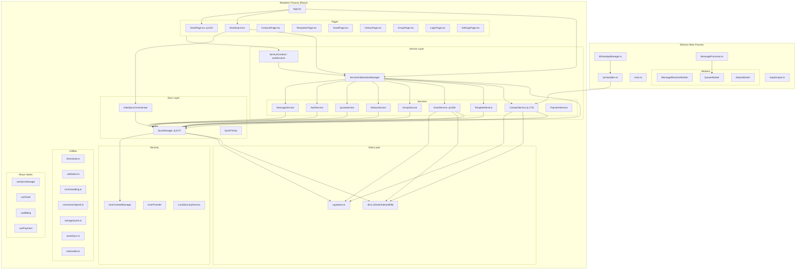
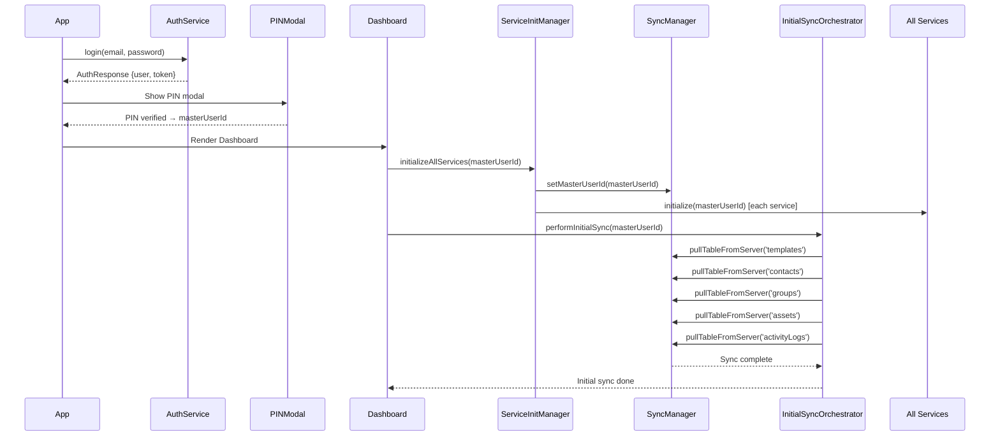

# Xenderin — Vectoring Index

> Architecture reference for file relationships, function responsibilities, and dependency flow.
> Last updated: 2026-02-14

---

## Project Architecture Overview



---

## Initialization Sequence



---

## File-by-File Vectoring Index

### Legend
- 🔴 = >1000 lines (refactor target)
- 🟡 = 500–1000 lines
- 🟢 = <500 lines
- `→` = depends on / imports
- `←` = imported by

---

## Layer 1: Sync Engine

### 🟡 `src/lib/sync/SyncManager.ts` (~870 lines)

**Purpose**: Central orchestrator for sync operations. Delegates specific logic to specialized modules.

**Shared State (mutable)**: `status`, `isOnline`, `masterUserId`, `connectionState`, `syncMetrics`, `retryDelays`, `syncCache`

| Function | Domain | Purpose |
|----------|--------|---------|
| `sync` | **Core** | Orchestrates Push -> Pull cycle |
| `pushCreate` | Push | Delegates to `SyncPushOperations` |
| `pushUpdate` | Push | Delegates to `SyncPushOperations` |
| `pushDelete` | Push | Delegates to `SyncPushOperations` |
| `pullFromServerWithCache` | Pull | Delegates to `SyncPullOperations` |
| `pullTableFromServer` | Pull | Delegates to `SyncPullOperations` |
| `partialSync` | Optimization | Delegates to `PartialSyncStrategy` |
| `backgroundSync` | Optimization | Delegates to `PartialSyncStrategy` |
| `getSyncStats` | Metrics | Delegates to `SyncMetricsAndCleanup` |

**Imports**: `SyncPullOperations`, `SyncPushOperations`, `PartialSyncStrategy`, `SyncMetricsAndCleanup`, `ConnectionMonitor`, `SyncQueue`

---

### 🟢 `src/lib/sync/SyncPullOperations.ts` (~320 lines)

**Purpose**: Handles data retrieval from Supabase, conflict resolution, and local DB updates.

**Key Functions**:
- `pullFromServerWithCache`: Orchestrates parallel table pulls with caching.
- `pullTableFromServer`: Fetches records for a single table (RPC or REST).
- `resolveConflict`: Implements Last-Write-Wins and other strategies.
- `_processServerRecords`: Bulk upsert/merge logic.

---

### 🟢 `src/lib/sync/SyncPushOperations.ts` (~210 lines)

**Purpose**: Handles data processing and transmission to Supabase.

**Key Functions**:
- `processBatchWithRetry`: Manages operation batches.
- `pushCreate`: Wrapper for Supabase `insert`.
- `pushUpdate`: Wrapper for Supabase `update`.
- `pushDelete`: Wrapper for Supabase `delete` (soft delete).

---

### 🟢 `src/lib/sync/PartialSyncStrategy.ts` (~270 lines)

**Purpose**: Implements optimized sync strategies for partial data loading and background synchronization.

**Key Functions**:
- `partialSync`: Syncs only a percentage of records (e.g. 50%) for fast startup.
- `calculateRecordLimit`: Determines how many records to fetch based on priority.
- `backgroundSync`: Fetches remaining records silently.
- `pullRemainingRecords`: Completes the dataset.

---

### 🟢 `src/lib/sync/SyncMetricsAndCleanup.ts` (~200 lines)

**Purpose**: Manages performance metrics and database cleanup.


---

### 🟢 `src/lib/sync/SyncPriority.ts` (58 lines)

**Purpose**: Priority enum and comparator for sync queue ordering.

---

### 🟢 `src/lib/services/InitialSyncOrchestrator.ts` (144 lines)

**Purpose**: Orchestrates the one-time initial sync after login. Iterates tables in order and reports progress.

**Key function**: `performInitialSync(masterUserId, onProgress, options)` — called by `Dashboard.tsx`

---

## Layer 2: Application Services

### 🔴 `src/lib/services/ContactService.ts` (1715 lines)

**Purpose**: CRUD + import + CRM pipeline + realtime subscriptions for contacts.

**State**: `masterUserId`, `syncManager`, `realtimeChannel`

| Function | Lines | Domain | Purpose |
|----------|-------|--------|---------|
| `constructor` | 29–32 | Init | Inject SyncManager |
| `setupSyncEventListeners` | 34–51 | Sync | React to sync events |
| `initialize` | 53–62 | Init | Set masterUserId |
| `isSyncInProgress` | 64–69 | Sync | Check initial sync flag |
| `backgroundSyncContacts` | 75–86 | Sync | Non-blocking sync trigger |
| `getCurrentUser` | 88–97 | Auth | Get Supabase user |
| `getMasterUserId` | 99–150 | Auth | Resolve masterUserId with fallback |
| `refreshFromSync` | 152–158 | Sync | Reload after sync |
| `transformLocalContacts` | 160–248 | Query | Dexie → UI type mapping |
| `getContacts` | 250–368 | **Core CRUD** | Get all contacts (local-first) |
| `enrichContactsWithGroups` | 370–391 | Query | Join group data |
| `fetchContactsFromServer` | 393–424 | Query | Direct Supabase fetch via RPC |
| `getContactsByGroupId` | 426–451 | Query | Filter by group |
| `getContactsByGroupIds` | 453–478 | Query | Filter by multiple groups |
| `getAllContacts` | 480–486 | Query | Alias (backward compat) |
| `getContactCount` | 488–503 | Query | Count contacts |
| `searchContacts` | 505–541 | Query | Search by name/phone/tags |
| `getContactById` | 543–588 | Core CRUD | Get single contact |
| `createContact` | 590–716 | **Core CRUD** | Create with offline-first sync |
| `createContacts` | 718–849 | **Batch Import** | Batch create for CSV/WhatsApp |
| `syncWhatsAppContactsDirectlyToServer` | 851–968 | **Import** | Server-first WhatsApp import |
| `upsertContactsFromWhatsApp` | 970–1088 | **Import** | Upsert contacts from WA |
| `updateContact` | 1090–1248 | **Core CRUD** | Update with sync |
| `deleteContact` | 1250–1330 | **Core CRUD** | Soft delete with sync |
| `deleteContactFromServer` | 1332–1345 | CRUD | Server-side delete fallback |
| `deleteMultipleContacts` | 1347–1414 | CRUD | Batch delete |
| `uploadContacts` | 1416–1435 | Import | File upload handler |
| `subscribeToContactUpdates` | 1438–1468 | **Realtime** | Supabase realtime channel |
| `unsubscribeFromContactUpdates` | 1470–1478 | Realtime | Cleanup channel |
| `getContactStats` | 1480–1527 | Stats | Contact statistics |
| `forceSync` | 1529–1534 | Sync | Manual sync trigger |
| `getSyncStatus` | 1536–1557 | Sync | Sync status object |
| `getContactsByLeadStatus` | 1559–1579 | **CRM** | Pipeline filter |
| `updateLeadStatus` | 1581–1601 | **CRM** | Drag-drop pipeline update |
| `getCRMStats` | 1603–1661 | **CRM** | Dashboard aggregates |
| `getSalesFunnel` | 1663–1694 | **CRM** | Pipeline stage counts |
| `getRecentActivity` | 1696–1707 | CRM | Recent contacts |
| `destroy` | 1709–1715 | Lifecycle | Cleanup |

**Imported by**: `ServiceInitializationManager`, `ServiceContext`, `index.ts`, `Dashboard.tsx`, `ContactsPage.tsx`, `ContactModal.tsx`, `InboxPage.tsx`, `NewChatDialog.tsx`, `DatabaseStatsCard.tsx`, `App.tsx`, `ipcHandlers.ts`

**Imports**: `SyncManager`, `db`, `supabase`, `UserContextManager`, `timestamp`, `validation`, `activityService`

---

### 🔴 `src/lib/services/AssetService.ts` (1258 lines)

**Purpose**: CRUD + upload + caching + prefetching for media assets (images, documents, audio, video).

**State**: `masterUserId`, `syncManager`, `initialSyncComplete`, `initialSyncPromise`

| Function | Lines | Domain | Purpose |
|----------|-------|--------|---------|
| `constructor` | 21–23 | Init | Inject SyncManager |
| `initialize` | 25–34 | Init | Set masterUserId |
| `isInitialSyncComplete` | 36–41 | Sync | Check sync flag |
| `waitForInitialSync` | 43–66 | Sync | Await with timeout |
| `getCurrentUser` | 69–78 | Auth | Get Supabase user |
| `getMasterUserId` | 80–104 | Auth | Resolve masterUserId |
| `transformLocalAssets` | 106–141 | Query | Dexie → UI type mapping |
| `getAssets` | 143–209 | **Core CRUD** | Get all assets (local-first) |
| `getAssetById` | 211–241 | Core CRUD | Single asset |
| `getAssetsByIds` | 243–266 | Core CRUD | Batch by IDs |
| `getAssetsByCategory` | 268–291 | Query | Filter by category |
| `uploadAssetOnline` | 293–360 | **Core CRUD** | Upload to Supabase Storage |
| `backgroundSyncAssets` | 362–373 | Sync | Non-blocking sync |
| `backgroundSyncPendingAssets` | 375–427 | Sync | Upload pending assets |
| `queueUpload` | 429–574 | **Core CRUD** | Offline-first upload queue |
| `deleteAsset` | 576–634 | Core CRUD | Soft delete with sync |
| `deleteAssetFromServer` | 636–661 | CRUD | Server delete fallback |
| `extractFileNameFromUrl` | 663–675 | Util | Parse storage URL |
| `getWhatsAppCompatibleAssets` | 677–695 | WhatsApp | Filter WA-compatible |
| `canSendViaWhatsApp` | 697–722 | WhatsApp | Validate WA compatibility |
| `getAssetStats` | 724–759 | Stats | Storage statistics |
| `getAssetDisplayInfo` | 761–799 | Display | Icon/label for UI |
| `formatFileSize` | 801–810 | Util | Bytes → human readable |
| `getAssetCategories` | 812–823 | Display | Category list |
| `getCategoryFromFileType` | 825–837 | Util | MIME → category |
| `forceSync` | 839–844 | Sync | Manual trigger |
| `getSyncStatus` | 846–867 | Sync | Status object |
| `destroy` | 869–874 | Lifecycle | Cleanup |
| `cacheAssetFile` | 876–937 | **Cache** | Store blob in IndexedDB |
| `getCachedAssetFile` | 940–965 | Cache | Retrieve cached blob |
| `getAssetWithCache` | 967–1024 | **Cache** | Auto-cache fetch |
| `clearAssetCache` | 1026–1048 | Cache | Evict by age |
| `getCurrentStorageUsage` | 1050–1061 | Cache | Disk usage |
| `evictOldestAssets` | 1063–1087 | Cache | LRU eviction |
| `syncAssetsFromSupabase` | 1089–1160 | **Sync** | Full asset sync + download |
| `prefetchAssets` | 1162–1253 | **Sync** | Background concurrent download |

**Imported by**: `ServiceInitializationManager`, `ServiceContext`, `index.ts`, `InitialSyncOrchestrator`, `PreflightService`, `AssetSelector.tsx`

**Imports**: `SyncManager`, `db`, `supabase`, `UserContextManager`, `timestamp`, `activityService`

---

## Layer 3: UI / Pages

### 🔴 `src/components/pages/SendPage.tsx` (1337 lines)

**Purpose**: WhatsApp campaign sending page — template selection, contact targeting, campaign execution.

**State**: React hooks (useState/useEffect), no persistent mutable state.

| Function | Lines | Domain | Purpose |
|----------|-------|--------|---------|
| `formatDelayLabel` | 73–78 | Util | Format delay for display |
| `SendPageContent` | 80–753 | **UI Component** | Full campaign form UI (673 lines!) |
| `SendPage` | 757–1337 | **Page Container** | State management + orchestration |
| `loadData` | 812–846 | Data | Fetch templates, contacts, groups, assets |
| `validateTemplateSync` | 855–863 | Validation | Check template exists on server |
| `getTargetContacts` | 865–870 | Computed | Selected contacts for campaign |
| `getSelectedTemplate` | 872–874 | Computed | Currently selected template |
| `getSelectedGroups` | 876–881 | Computed | Selected groups |
| `getSelectedAssets` | 883–885 | Computed | Selected assets |
| `toggleAssetSelection` | 887–893 | UI Logic | Toggle asset checkbox |
| `getAssetIcon` | 895–902 | Display | Icon by category |
| `formatFileSize` | 904–910 | Util | Size formatting |
| `checkRecentSendVolume` | 912–925 | **Safety** | Spam prevention check |
| `handleStartCampaign` | 927–968 | **Campaign** | Pre-flight validation |
| `proceedWithCampaign` | 970–1094 | **Campaign** | Execute campaign (IPC → Electron) |
| `previewMessage` | 1096–1120 | Preview | Template preview rendering |
| `processLogs` | 1188–1209 | Logging | Campaign result logging |

**Imported by**: `App.tsx` (route only)

**Imports**: `useServices` (ServiceContext), `PreflightService`, `BackgroundTaskContext`, many UI components

---

## Layer 4: Data Layer

### 🟡 `src/lib/db.ts` (686 lines)

**Purpose**: Dexie (IndexedDB) schema, table definitions, sync queue, and data clearing operations.

**Key exports**: `db` instance, `SyncOperation` type, `LocalContact`, `LocalAsset`, `LocalTemplate`

**Imported by**: All services, `SyncManager`, `InitialSyncOrchestrator`

---

### 🟡 `src/lib/supabase.ts` (204 lines)

**Purpose**: Supabase client factory, auth helpers, RPC helpers, error handling.

**Key exports**: `supabase`, `authHelpers`, `rpcHelpers`, `handleDatabaseError`

---

## Layer 5: Security

### 🟡 `src/lib/security/UserContextManager.ts` (561 lines)

**Purpose**: Multi-tenant user context. Resolves `masterUserId`, enforces data isolation, manages permissions.

**Imported by**: `SyncManager`, all services, `UserProvider`

---

## Layer 6: Orchestration

### 🟢 `src/lib/services/ServiceInitializationManager.ts` (316 lines)

**Purpose**: Singleton that initializes all services with `masterUserId` in correct order. Prevents race conditions via async lock.

**Initialization order**:
1. SyncManager.setMasterUserId
2. TemplateService.initialize
3. ContactService.initialize
4. GroupService.initialize
5. AssetService.initialize
6. HistoryService.initialize
7. AuthService (no masterUserId needed)
8. QuotaService.initialize
9. PaymentService (no masterUserId needed)
10. MessageService.initialize

---

## Layer 7: Electron Main Process

### 🟡 `src/main/WhatsAppManager.ts` (824 lines)

**Purpose**: WhatsApp Web automation via Puppeteer. Manages session, sends messages, handles QR auth.

### 🟡 `src/main/ipcHandlers.ts` (408 lines)

**Purpose**: Electron IPC bridge between renderer and main process.

### 🟡 `src/main/mapScraper.ts` (761 lines)

**Purpose**: Google Maps scraping for lead generation.

---

## Cross-Cutting Dependency Map

```
                    ┌──────────────┐
                    │   App.tsx    │
                    └──────┬───────┘
                           │
              ┌────────────┼────────────┐
              ▼            ▼            ▼
         Dashboard     SendPage     LoginPage
              │            │
              ▼            │
    ServiceInitManager     │
              │            │
    ┌─────────┼─────────┐  │
    ▼         ▼         ▼  ▼
 Contact   Template   Asset   Group   History   Quota   Message   Auth
 Service   Service    Service Service Service   Service Service   Service
    │         │         │      │        │         │       │         │
    └────────┬┴─────────┴──────┴────────┴─────────┴───────┴─────────┘
             ▼
       ┌──────────┐
       │SyncManager│ ◄── InitialSyncOrchestrator
       └────┬─────┘
            │
    ┌───────┴───────┐
    ▼               ▼
  db.ts         supabase.ts
 (Dexie)       (Supabase Client)
```

---

## Utility Dependencies

| Utility | Used By | Purpose |
|---------|---------|---------|
| `timestamp.ts` | All services, SyncManager | ISO timestamp normalization, conversion |
| `validation.ts` | ContactService, TemplateService | Input sanitization, UUID validation |
| `errorHandling.ts` | All pages | User-facing error messages |
| `connectionSpeed.ts` | SyncManager | Network quality assessment |
| `storageQuota.ts` | AssetService | IndexedDB quota management |
| `assetSync.ts` | AssetService | Asset sync helpers |
| `xlsHandler.ts` | ContactService (via UI) | Excel/CSV parsing |
